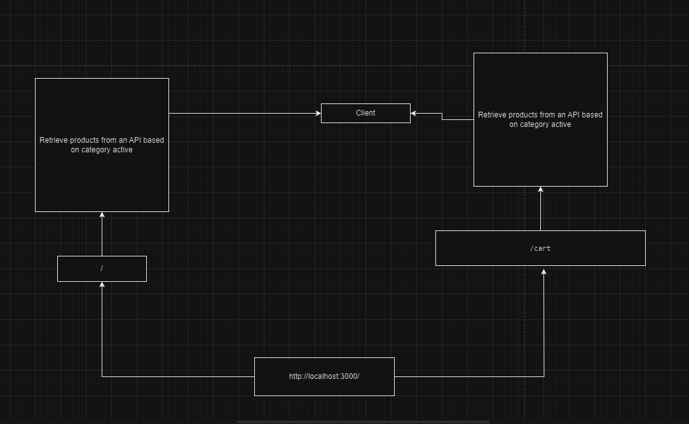

# StoreFront

This application is meant to provide a service for the user to browse products based on the category selected and to add the products in a cart so it could be later seen in a checkout menu, also to see details about certain products.

## UML

SandBox Link: Phase 1 <https://v3wzvn.csb.app/>

SandBox Link: Phase 2 <https://57kckj.csb.app/>
